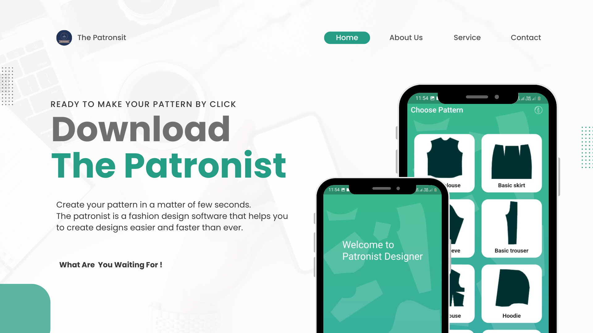
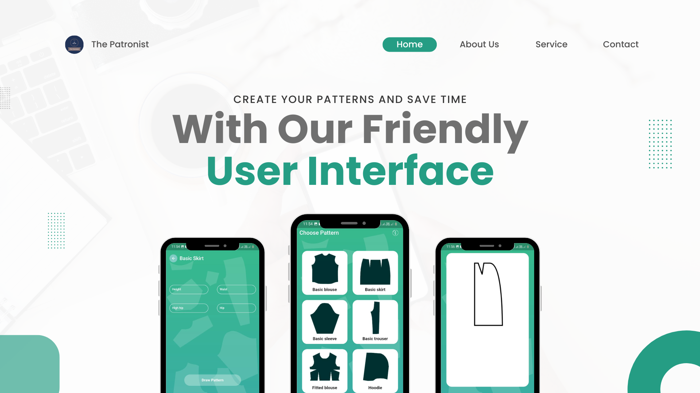
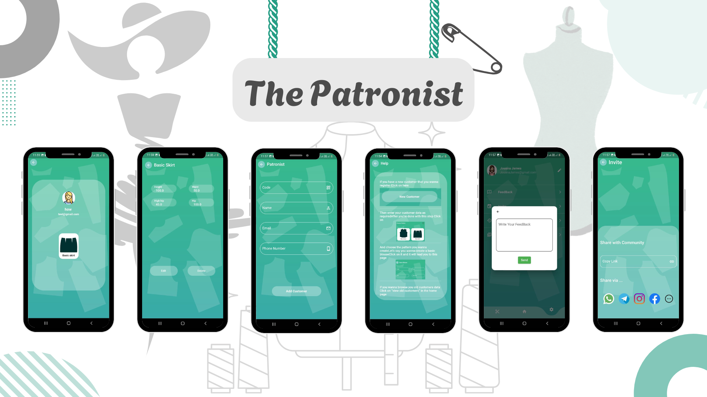

<p align="center">
  <!-- Replace "screenshots/logo.jpg" with your actual logo or main image -->
  
</p>

## Content
- [Description](#description)
- [Features](#features)
- [Tools](#tools)
- [Screenshots](#screenshots)
- [Deployment](#deployment)
- [APK Path](#apk-path)
- [Contact](#contact)

---

## Description
**The Patronist** is an advanced fashion design software that allows users to create patterns effortlessly in just a few seconds. It revolutionizes the traditional pattern-making process by eliminating the need for manual drawing, reducing material waste, and increasing efficiency through automation.

This software is designed for both professionals and beginners, offering an intuitive interface that requires no prior experience in pattern design

---

## Features

- **User-Friendly Interface:**

Simple and intuitive UI for seamless navigation and design preview.

- **Pattern Creation:**

Generate patterns using built-in mathematical operations with precision and accuracy.

- **Measurement Management:**

Users can input specific measurements and store them for future use.

- **File & Format Conversion:**

Convert patterns into PDF and other industry-standard formats for printing and sharing.

- **Printing Support:**

Export and print patterns directly from the application with accurate scaling.

- **Data Storage:**

Store customer-specific measurements and maintain a catalog of standard designs.

- **Security & Access Control:**

Users can securely manage and store data with role-based access (Company vs. Individual User).

- **Performance & Speed:**

Fast file conversion and efficient design rendering for a smooth user experience.

- **Cloud & Synchronization (Future Enhancements):**

Enable users to access their designs from multiple devices.

---

## Tools


---

## Screenshots

<!-- Replace these with your actual screenshots -->

---


---

## Deployment

To deploy this project run this command in terminal

```bash
 flutter build apk
```

## APK Path 
build/app/outputs/flutter-apk/app-release.apk


## Contact
For any questions or feedback, please reach out to:

Email: MazenOthman320@gmail.com

